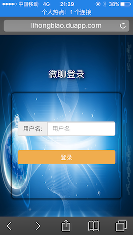

# 基于NodeJS+socket.io+jQuery+Bootstrap实现的响应式聊天室
WL是微聊系统的简称. 微聊系统界面是基于微信客户端，与微信客户端界面非常的类似,可以进行群聊和私聊.

在线体验网址为: http://lihongbiao.duapp.com

微聊系统主要功能:
1. 提供一个登陆界面,输入用户名直接可登录;
   
2. 登陆后显示用户列表界面,系统会随机给登录用户一个头像,用户列表界面中可以看到已经登录的用户(除自己外,自己不会显示到用户列表中);
3. 点击某个用户可以进入到相应的聊天窗口,可以与对应的用户进行聊天;同样聊天窗口中可以返回到用户列表界面;
4. 聊天内容包括纯文本、表情、图片,点击发送的图片可以显示全屏显示大图;
5. 可以显示未读消息条数,当用户收到来自其他用户的消息时,如果不是同时在与该用户聊天,收到的消息会被当作未读消息并显示未读消息的条数;
